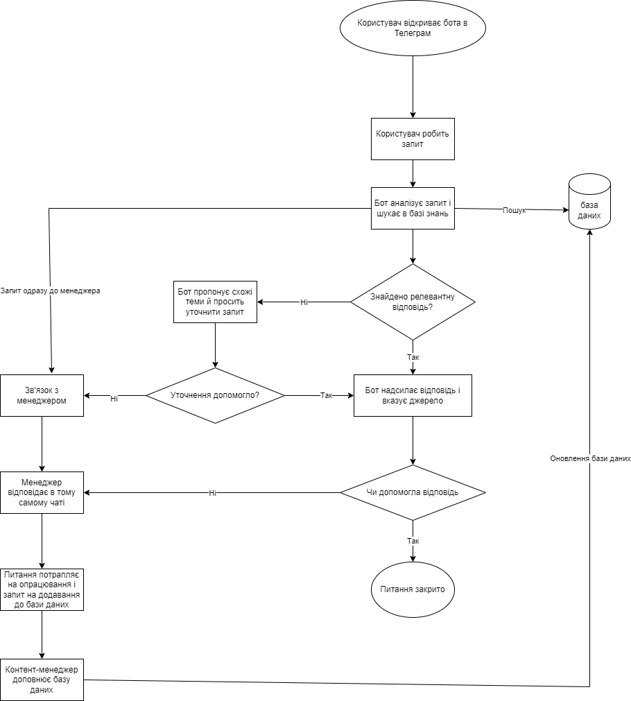

# AI-бот у Telegram на базі знань компанії

Тестове завдання на позицію Trainee Business Analyst, Neurotrack.

## Завдання

Клієнт хоче, щоб AI-бот у Telegram відповідав на запитання на основі бази знань компанії.
Потрібно написати 3 User Stories та намалювати схему процесу: як користувач ставить запитання
й отримує відповідь.

## Що в репозиторії

| Файл | Що всередині |
|---|---|
| [docs/user-stories.md](docs/user-stories.md) | 3 User Stories з критеріями прийняття |
| [docs/process-flow.drawio.png](docs/process-flow.drawio.png) | Схема процесу |
| [docs/process-flow.drawio](docs/process-flow.drawio) | Вихідник схеми, diagrams.net |

## Навіщо цей бот компанії

Клієнти пишуть у месенджер у зручний для них час: ввечері, у вихідні, поза графіком менеджерів.
Питання при цьому здебільшого однакові. Скільки коштує, чи є в наявності, які терміни, як почати.
Відповіді на них уже є в матеріалах компанії, але дістати їх можна тільки через менеджера.

Бот прибирає це очікування для типових питань і залишає менеджерам ті звернення,
де потрібна людина.

Головне правило, на якому побудований весь процес: бот відповідає тільки на матеріалах бази знань.
Якщо відповіді там немає, він не вигадує, а передає питання менеджеру. Неправильна відповідь
про ціну або терміни обходиться компанії дорожче, ніж чесне "не знаю, зараз підключаю менеджера".

## Схема процесу

Коротко про логіку:

1. Користувач пише запит звичайною мовою, бот шукає відповідь у базі знань.
2. Якщо знайшов, дає відповідь і вказує розділ, звідки її взяв.
3. Якщо не знайшов, пропонує схожі теми й просить уточнити запит.
4. Якщо уточнення не допомогло або користувач сам захотів людину, бот передає діалог менеджеру
   разом з усім контекстом розмови.
5. Питання, яке залишилось без відповіді, потрапляє на опрацювання і повертається в базу знань
   уже як новий матеріал.

Останній крок найважливіший. Саме він робить так, що бот з часом відповідає краще,
а не застаріває разом з базою знань.

## User Stories

| # | Роль | Про що історія |
|---|---|---|
| 1 | Клієнт | Отримати відповідь одразу, не підлаштовуючись під графік менеджера |
| 2 | Клієнт | Швидко перейти на менеджера, коли питання не для бота |
| 3 | Контент-менеджер | Бачити прогалини бази знань і закривати їх |

Повний текст з критеріями прийняття: [docs/user-stories.md](docs/user-stories.md).
---
